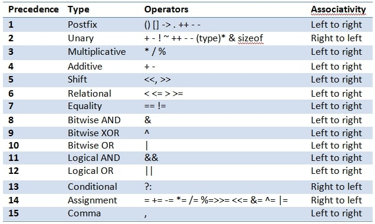

# 001 Section Into

# 003

# 004 Linking a JavaScript File

- To link js script in html file add: `<script src="test.js">`

# 005 Values and Variables

## variable naming

- Camel case format which only accept later, number ,dollar sign and underscore
- should not use "name" as variable name
- first letter small letter

# 007 Data Types


Number, boolean, string,Undefined, Null

- can use "typeof" operator to know the type of values
- `console.log(typeof null) return "object" which is considered as a bug.

# 008 let, const and var

# 009 Basic Operators

- can concatenate strings with '+' operator.
- `x = x + 10 same as x += 10`
- `x = x + 1 same as x ++`
- comparison operators(>,<,>=) return boolean value
- use "**" as "two the power" like `x squire as x ** 2`
- use '==' comparator to check the vales only and use '===' to check the values as well as type(no auto type conversion by js(coercion))

# 010 operator precedence

- associativity is important(calculate from left to right or right to left)



# 011 coding challenge #1

```javascript
/*
Mark and John are trying to compare their BMI (Body Mass Index), which is
calculated using the formula:
BMI = mass / height ** 2 = mass / (height * height) (mass in kg
and height in meter).
Your tasks:

1. Store Mark's and John's mass and height in variables
2. Calculate both their BMIs using the formula (you can even implement both
   versions)
3. Create a Boolean variable 'markHigherBMI' containing information about
   whether Mark has a higher BMI than John.
   Test data:
   § Data 1: Marks weights 78 kg and is 1.69 m tall. John weights 92 kg and is 1.95
   m tall.
   § Data 2: Marks weights 95 kg and is 1.88 m tall. John weights 85 kg and is 1.76
   m tall.
*/

const markMass = 78;
const johnMass = 92;
const markHeight = 1.69;
const johnHeight = 1.95;

const markHigherBMI = markMass / markHeight ** 2 > johnMass / johnHeight ** 2;
const johnHigherBMI = johnMass / johnHeight ** 2 > markMass / markHeight ** 2;

console.log(markHigherBMI, johnHigherBMI);
```

# 012 String and template literals

```javascript
const myName = "Manab";

console.log(`My name is ${myName}.`);
```

- To start a new line(multiline) use "\n\" or ``

```javascript
console.log(
	"My name is Manab \n\
  I am 22 years old"
);
// can just use `` for multiline
console.log(`My name is Manab
  I am 22 years old`);
```

# 013 Taking Decisions if else statements

```javascript
const age = 22;

if (age >= 21) {
	console.log("Manab is ready to get married.");
} else {
	console.log("Manab is not ready to get married.");
}
```

# 014 CodingChallenge#2

```javascript
/*
Use the BMI example from Challenge #1, and the code you already wrote, and
improve it.
Your tasks:
1. Print a nice output to the console, saying who has the higher BMI. The message
is either "Mark's BMI is higher than John's!" or "John's BMI is higher than Mark's!"
2. Use a template literal to include the BMI values in the outputs. Example: "Mark's
BMI (28.3) is higher than John's (23.9)!"
Hint: Use an if/else statement 😉
*/

const markMass = 78;
const johnMass = 102;
const markHeight = 1.69;
const johnHeight = 1.95;

const markBMI = markMass / markHeight ** 2;
const johnBMI = (johnMass / johnHeight) * johnHeight;

if (markBMI > johnBMI) {
	console.log(`Mark's BMI(${markBMI}) is higher than John's BMI(${johnBMI})`);
} else {
	console.log(`Mark's BMI(${markBMI}) is lower than John's BMI(${johnBMI})`);
}
```

# 015 Type conversion and coercion

- Type coercion = javascript do the conversion automatically when it has to deal with two different type of values

  ```javascript
  const age = 22; //type of number
  const myName = "Manab"; //type of string

  //js type coercion automatically
  let fullString = myName + " is " + age;
  ```

- ❓❓ Have some confusion about how js decide which type to convert to whom

# 016 Truthy and Falsy values

- 5 falsy values: 0, '', undefined, null, NaN which return false as boolean

  ```javascript
  console.log(Boolean(0)); //return false
  console.log(Boolean(undefined)); //return false
  console.log(Boolean("jonas")); //return true
  console.log(Boolean({})); //return true
  console.log(Boolean("")); //return false
  ```

# 017 Equality operators == vs ===

- use '==' comparator to check the vales only and use '===' to check the values as well as type(no auto type conversion by js(coercion))
- user prompt in browser take input as string

# 018 Boolean logic

- 'And' operator
  - true + true = true
  - true + false = false
  - false + false = false
- 'Or' operator
  - true + true = true
  - true + false = true
  - false + false = false

# 019 Logical operators

- And operator = '&&'
- Or operator = '||'
- Not operator = '!'

# 020 Coding challenge #3

```javascript
/*
There are two gymnastics teams, Dolphins and Koalas. They compete against each
other 3 times. The winner with the highest average score wins a trophy!
Your tasks:
1. Calculate the average score for each team, using the test data below
2. Compare the team's average scores to determine the winner of the competition,
and print it to the console. Don't forget that there can be a draw, so test for that
as well (draw means they have the same average score)
3. Bonus 1: Include a requirement for a minimum score of 100. With this rule, a
team only wins if it has a higher score than the other team, and the same time a
score of at least 100 points. Hint: Use a logical operator to test for minimum
score, as well as multiple else-if blocks 😉
4. Bonus 2: Minimum score also applies to a draw! So a draw only happens when
both teams have the same score and both have a score greater or equal 100
points. Otherwise, no team wins the trophy
Test data:
§ Data 1: Dolphins score 96, 108 and 89. Koalas score 88, 91 and 110
§ Data Bonus 1: Dolphins score 97, 112 and 101. Koalas score 109, 95 and 123
§ Data Bonus 2: Dolphins score 97, 112 and 101. Koalas score 109, 95 and 106
*/
const dolphinAvg = (97 + 112 + 101) / 3;
const koalasAvg = (109 + 95 + 106) / 3;

if (dolphinAvg > 100 && koalasAvg > 100) {
	if (dolphinAvg === koalasAvg) {
		console.log(
			`It's a draw between the Dolphin(${dolphinAvg} point) and Koalas(${koalasAvg} point)`
		);
	} else if (dolphinAvg > koalasAvg) {
		console.log(`Dolphin(${dolphinAvg} point) won the game against Koalas(${koalasAvg} point)`);
	} else {
		console.log(`Koalas(${koalasAvg} point) won the game against  Dolphin(${dolphinAvg} point)`);
	}
} else {
	console.log(`Nobody wins as their avg scores are less than 100.
	Dolphin(${dolphinAvg} point).
	Koalas(${koalasAvg} point`);
}
```

# 21 The switch statement

- switch statement use strict comparison (===)
- if 'break' is not mentioned the code will also execute the next case until it finds the break statement

```javascript
var role = "supervisor";

switch (role) {
	case "labour":
		console.log("Labour salary is 350rs");
		break;
	case "mason":
		console.log("Mason's salary is 450rs");
		break;
	case "painter":
		console.log("Painter's salary is 450rs");
		break;
	default:
		console.log("Your salary is unknown");
}
```

# 22 Statements and Expressions

- statements are like sentence like if statements and switch statement which doesn't produce values
- expression produce values like
  ```javascript
  3 + 5;
  ```

# 23 The conditional (Ternary) operator

- it is like if-else statement

- Ternary operator can use expression to return values

```javascript
const age = 21;
age >= 21 ? console.log("I am ready to get married") : console.log("Not ready for married");

const isReady = age >= 21 ? true : false;
console.log(isReady);
```

# 24 Coding Challenge 04

```javascript
/*
Steven wants to build a very simple tip calculator for whenever he goes eating in a 
restaurant. In his country, it's usual to tip 15% if the bill value is between 50 and 
300. If the value is different, the tip is 20%. 

Your tasks: 
1. Calculate the tip, depending on the bill value. Create a variable called 'tip' for 
this. It's not allowed to use an if/else statement 😅 (If it's easier for you, you can 
start with an if/else statement, and then try to convert it to a ternary 
operator!) 
2. Print a string to the console containing the bill value, the tip, and the final value 
(bill + tip). Example: “The bill was 275, the tip was 41.25, and the total value 
316.25” 
Test data: 
§ Data 1: Test for bill values 275, 40 and 430 
Hints: 
§ To calculate 20% of a value, simply multiply it by 20/100 = 0.2 
§ Value X is between 50 and 300, if it's >= 50 && <= 300 😉
*/

var tip = 0;

billValue = 430;

tip = billValue >= 50 && billValue <= 150 ? (billValue * 15) / 100 : (billValue * 20) / 100;

console.log(`Your Bill: ${billValue}`);
console.log(`Your Tip: ${tip}`);
console.log(`Your Total Bill: ${billValue + tip}`);
```

# 25 JavaScript releases

## Finished at 05-07-2022
